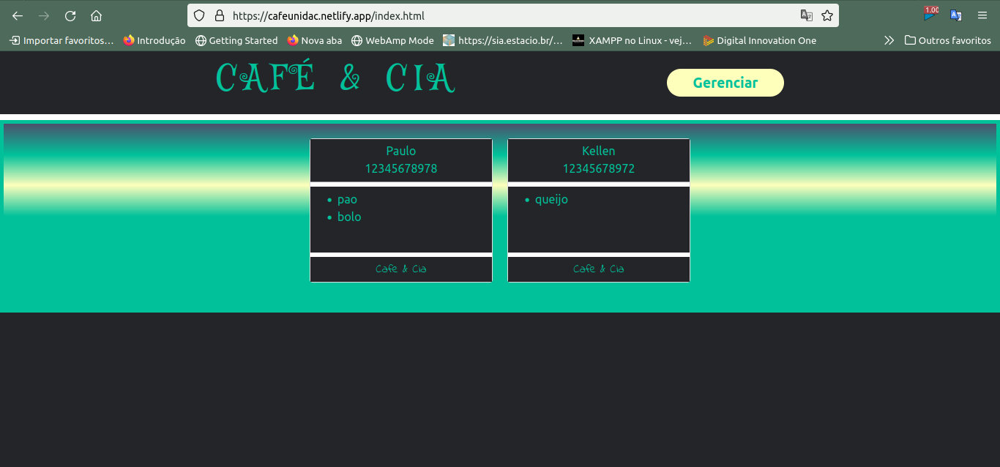
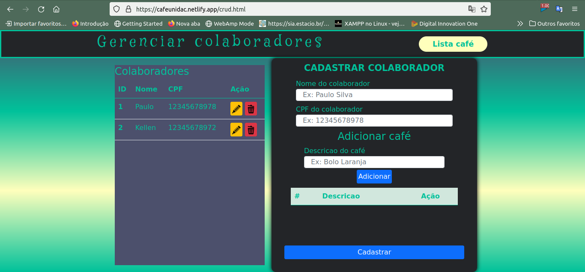

# desafio-unidac-gerenciarCafeDaManha
Desafio Unidac - Grupo WL

### Link do projeto em produção:
###### Frontend -> [cafeappp.netlify.app](https://cafeappp.netlify.app/)
###### Backend -> https://desafioapp.herokuapp.com

# Sobre o projeto

Este projeto foi um desafio para desenvolver uma aplicação web para gerenciar o café da manhã na empresa,
utilizando JAVA no backend com Spring Boot e HTML,CSS,SCSS e JavaScript no frontend

# Realizamos café da manhã constantemente e sempre há conflito no merge kkkk
# Sempre há pessoas que querem trazer pão, bolo, suco...

## Obs: Regras aplicadas
#### Utilizar NativeQuery para inserção, atualização, consulta e exclusão.
#### Não poderá repetir cpf.
#### Não poderá repetir opção de café da manhã mesmo que seja outro colaborador. 

## Layout web
<div align="center">

<kbd></kbd> 

<kbd></kbd>


# Tecnologias utilizadas
## Back end
 Java
 Spring Boot
 JPA / Hibernate
 Maven
 Postgres
 SQL
## Front end
 HTML / CSS / SCSS
 JavaScript
## Implantação em produção
 Back end: Heroku |
 Front end web: Netlify |
 Banco de dados: Postgresql

# Como executar o projeto

## Back end
Pré-requisitos: Java 11

```bash
# clonar repositório
git clone https://github.com/Anacubits/desafio-unidac-grupo-wl.git

# entrar na pasta do projeto back end
cd backend

# executar o projeto
./mvnw spring-boot:run

Obs: O servidor iniciará na porta 8080 - Acesse <http://localhost:8080>
     /h2-console
```


# Autor

<div align="center">
  
***Ana Cubits***

https://github.com/Anacubits

https://www.linkedin.com/in/ana-vict%C3%B3ria-4462101a3/

</div>


